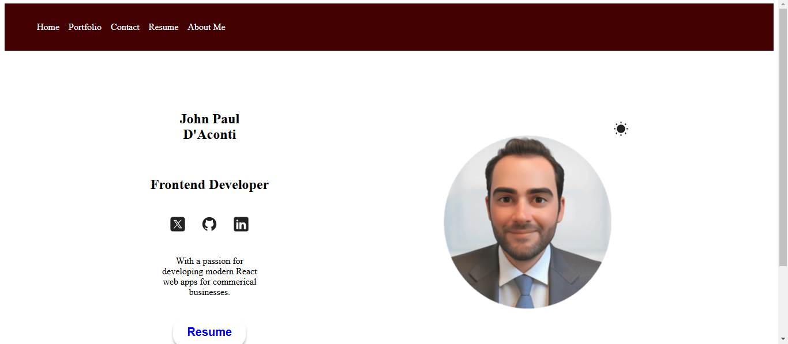

# Code Bro React Project
## Description

The Code Bro React Project is a modern web application built using React and Vite. This project showcases a portfolio of projects, skills, and contact information, providing a comprehensive overview of a developer's capabilities and experience. The application features a clean and responsive design, ensuring a seamless user experience across various devices.

## Features

- **Portfolio Section**: Displays a collection of projects with descriptions and links to their respective repositories.
- **Skills Section**: Highlights the developer's technical skills with visual representations.
- **Contact Section**: Provides a contact form for users to get in touch.
- **Dark Mode**: Toggle between light and dark themes for better accessibility.
- **Responsive Design**: Ensures the application looks great on all screen sizes.

## Technologies Used

- **React**: A JavaScript library for building user interfaces.
- **Vite**: A fast build tool and development server.
- **React Router**: For handling routing within the application.
- **CSS Modules**: For styling components with scoped CSS.
- **ESLint**: For maintaining code quality and consistency.

## Getting Started

To get started with the project, follow these steps:

1. **Clone the repository**:
    ```sh
    git clone https://github.com/Dsien/CodeBro.git
    cd CodeBro
    ```

2. **Install dependencies**:
    ```sh
    npm install
    ```

3. **Run the development server**:
    ```sh
    npm run dev


# Repo Link
https://github.com/Dsien/CodeBro.git


